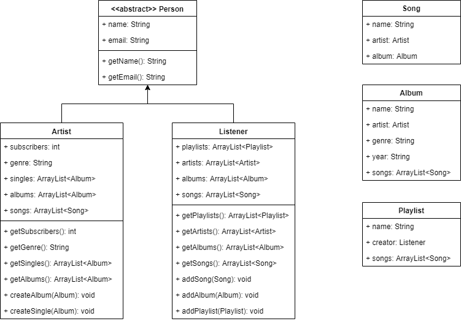

# Прототип музыкального приложения
Прототип музыкального приложения реализует функционал для двух видов пользователей: Артист и Слушатель
Краткое описание структуры:
* Оба класса наследуются от единого класса Person с основной информацией о пользователе (человеке).
* Артист может выкладывать новый музыкальный материал: Сингл или Альбом. Он добавится в его профиле Артиста.
* Слушатель может добавить себе Сингл или Альбом, а также создать плейлист.

UML-диаграмма прототипа:

